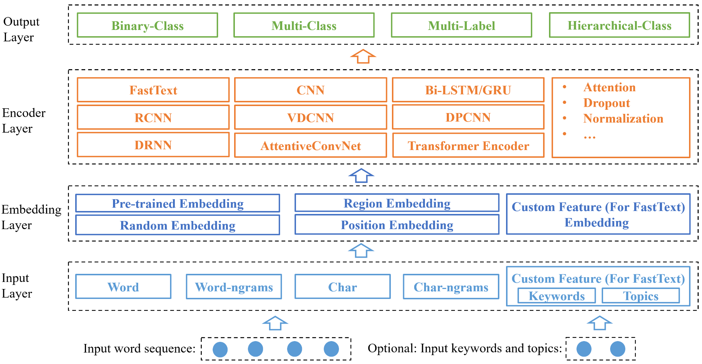

# NeuralClassifier: An Open-source Neural Hierarchical Multi-label Text Classification Toolkit

## Introduction

NeuralClassifier is designed for quick implementation of neural models for hierarchical multi-label classification task, which is more challenging and common in real-world scenarios. A salient feature is that NeuralClassifier currently provides a variety of text encoders, such as FastText, TextCNN, TextRNN, RCNN, VDCNN, DPCNN, DRNN, AttentiveConvNet and Transformer encoder, etc. It also supports other text classification scenarios, including binary-class and multi-class classification. It is built on [PyTorch](https://pytorch.org/). Experiments show that models built in our toolkit achieve comparable performance with reported results in the literature.

## Support tasks

* Binary-class text classifcation
* Multi-class text classification
* Multi-label text classification
* Hiearchical (multi-label) text classification (HMC)

## Support text encoders

* TextCNN ([Kim, 2014](https://arxiv.org/pdf/1408.5882.pdf))
* RCNN ([Lai et al., 2015](https://www.aaai.org/ocs/index.php/AAAI/AAAI15/paper/download/9745/9552))
* TextRNN ([Liu et al., 2016](https://arxiv.org/pdf/1605.05101.pdf))
* FastText ([Joulin et al., 2016](https://arxiv.org/pdf/1607.01759.pdf))
* VDCNN ([Conneau et al., 2016](https://arxiv.org/pdf/1606.01781.pdf))
* DPCNN ([Johnson and Zhang, 2017](https://www.aclweb.org/anthology/P17-1052))
* AttentiveConvNet ([Yin and Schutze, 2017](https://arxiv.org/pdf/1710.00519.pdf))
* DRNN ([Wang, 2018](https://www.aclweb.org/anthology/P18-1215))
* Region embedding ([Qiao et al., 2018](http://research.baidu.com/Public/uploads/5acc1e230d179.pdf))
* Transformer encoder ([Vaswani et al., 2017](https://papers.nips.cc/paper/7181-attention-is-all-you-need.pdf))
* Star-Transformer encoder ([Guo et al., 2019](https://arxiv.org/pdf/1902.09113.pdf))

## Requirement

* Python 3
* PyTorch 0.4+
* Numpy 1.14.3+

## System Architecture

## Usage

### Training

    python train.py conf/train.json

***Detail configurations and explanations see [Configuration](readme/Configuration.md).***

The training info will be outputted in standard output and log.logger\_file.

### Evaluation
    python eval.py conf/train.json

* if eval.is\_flat = false, hierarchical evaluation will be outputted.
* eval.model\_dir is the model to evaluate.
* data.test\_json\_files is the input text file to evaluate.

The evaluation info will be outputed in eval.dir.

## Input Data Format

    JSON example:

    {
        "doc_label": ["Computer--MachineLearning--DeepLearning", "Neuro--ComputationalNeuro"],
        "doc_token": ["I", "love", "deep", "learning"],
        "doc_keyword": ["deep learning"],
        "doc_topic": ["AI", "Machine learning"]
    }

    "doc_keyword" and "doc_topic" are optional.

## Performance

### 0. Dataset

<table>
<tr><th>Dataset<th>Taxonomy<th>#Label<th>#Training<th>#Test
<tr><td>RCV1<td>Tree<td>103<td>23,149<td>781,265
<tr><td>Yelp<td>DAG<td>539<td>87,375<td>37,265
</table>

* RCV1: [Lewis et al., 2004](http://www.jmlr.org/papers/volume5/lewis04a/lewis04a.pdf)
* Yelp: [Yelp](https://www.yelp.com/dataset/challenge)

### 1. Compare with state-of-the-art
<table>
<tr><th>Text Encoders<th>Micro-F1 on RCV1<th>Micro-F1 on Yelp
<tr><td>HR-DGCNN (Peng et al., 2018)<td>0.7610<td>-
<tr><td>HMCN (Wehrmann et al., 2018)<td>0.8080<td>0.6640
<tr><td>Ours<td><strong>0.8313</strong><td><strong>0.6704</strong>
</table>

* HR-DGCNN: [Peng et al., 2018](http://www.cse.ust.hk/~yqsong/papers/2018-WWW-Text-GraphCNN.pdf)
* HMCN: [Wehrmann et al., 2018](http://proceedings.mlr.press/v80/wehrmann18a/wehrmann18a.pdf)

### 2. Different text encoders

<table>
<tr><th row_span='2'>Text Encoders<th colspan='2'>RCV1<th colspan='2'>Yelp
<tr><td><th>Micro-F1<th>Macro-F1<th>Micro-F1<th>Macro-F1
<tr><td>TextCNN<td>0.7717<td>0.5246<td>0.6281<td>0.3657
<tr><td>TextRNN<td>0.8152<td>0.5458<td><strong>0.6704</strong><td>0.4059
<tr><td>RCNN<td><strong>0.8313</strong><td><strong>0.6047</strong><td>0.6569<td>0.3951
<tr><td>FastText<td>0.6887<td>0.2701 <td>0.6031<td>0.2323
<tr><td>DRNN<td>0.7846 <td>0.5147<td>0.6579<td>0.4401
<tr><td>DPCNN<td>0.8220 <td>0.5609 <td>0.5671 <td>0.2393
<tr><td>VDCNN<td>0.7263 <td>0.3860<td>0.6395<td>0.4035
<tr><td>AttentiveConvNet<td>0.7533<td>0.4373<td>0.6367<td>0.4040
<tr><td>RegionEmbedding<td>0.7780 <td>0.4888 <td>0.6601<td><strong>0.4514</strong>
<tr><td>Transformer<td>0.7603 <td>0.4274<td>0.6533<td>0.4121
<tr><td>Star-Transformer<td>0.7668 <td>0.4840<td>0.6482<td>0.3895

</table>

### 3. Hierarchical vs Flat

<table>
<tr><th row_span='2'>Text Encoders<th colspan='2'>Hierarchical<th colspan='2'>Flat
<tr><td><th>Micro-F1<th>Macro-F1<th>Micro-F1<th>Macro-F1
<tr><td>TextCNN<td>0.7717<td>0.5246<td>0.7367<td>0.4224
<tr><td>TextRNN<td>0.8152<td>0.5458<td>0.7546 <td>0.4505
<tr><td>RCNN<td><strong>0.8313</strong><td><strong>0.6047</strong><td><strong>0.7955</strong><td><strong>0.5123</strong>
<tr><td>FastText<td>0.6887<td>0.2701 <td>0.6865<td>0.2816
<tr><td>DRNN<td>0.7846 <td>0.5147<td>0.7506<td>0.4450
<tr><td>DPCNN<td>0.8220 <td>0.5609 <td>0.7423  <td>0.4261
<tr><td>VDCNN<td>0.7263 <td>0.3860<td>0.7110<td>0.3593
<tr><td>AttentiveConvNet<td>0.7533<td>0.4373<td>0.7511<td>0.4286
<tr><td>RegionEmbedding<td>0.7780 <td>0.4888 <td>0.7640<td>0.4617
<tr><td>Transformer<td>0.7603 <td>0.4274<td>0.7602<td>0.4339
<tr><td>Star-Transformer<td>0.7668 <td>0.4840<td>0.7618<td>0.4745
</table>

## Acknowledgement

Some public codes are referenced by our toolkit:

* https://pytorch.org/docs/stable/
* https://github.com/jadore801120/attention-is-all-you-need-pytorch/
* https://github.com/Hsuxu/FocalLoss-PyTorch
* https://github.com/Shawn1993/cnn-text-classification-pytorch
* https://github.com/ailias/Focal-Loss-implement-on-Tensorflow/
* https://github.com/brightmart/text_classification
* https://github.com/NLPLearn/QANet
* https://github.com/huggingface/pytorch-pretrained-BERT

## Update

* 2019-04-29, init version
